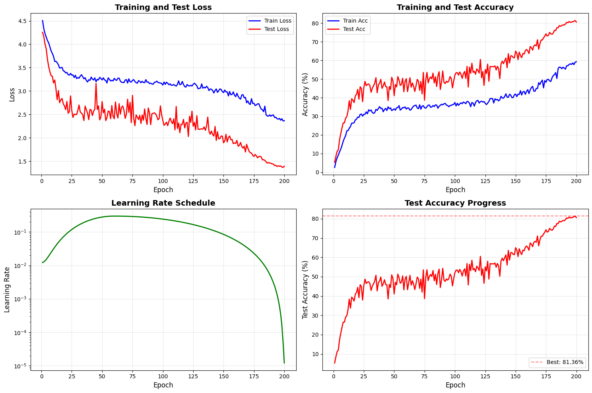

# WideResNet-28-10 on CIFAR-100

NoteBook Link - https://colab.research.google.com/drive/1lX0zJ-UMsALPBJo8rU4bpzZGw4SJU84r?usp=sharing
Training logs - 'trainglogs.md'

## Abstract

This experiment was conducted as part of a project requirement to train a ResNet-family architecture from scratch on the CIFAR-100 dataset and achieve a minimum Top-1 accuracy of 73 %.
No pretrained weights or external datasets were used.
All components including model architecture, data pipeline, augmentations, optimizer, and scheduler were implemented manually.
The final model achieved 81.36 % Top-1 accuracy, significantly exceeding the target benchmark.

I used  Wide Residual Network (WRN-28-10) along with  using modern regularization and optimization strategies. With strong data augmentation, label smoothing, and adaptive learning rate scheduling, without relying on additional pre-training or external data. The resulting model achieves **81.36% test accuracy**, demonstrating the continued competitiveness of WideResNet architectures when coupled with effective regularization and optimization recipes.

---

## 1. Model Architecture

The model is based on the **WideResNet-28-10** variant, consisting of 28 convolutional layers with a widening factor of 10. Each residual unit follows the pre-activation layout (BatchNorm → ReLU → Conv) with optional dropout regularization.

**Key architectural characteristics:**

* Depth: 28 (corresponding to *n=4* residual blocks per stage)
* Widen factor: 10
* Total stages: 3 (each halving spatial resolution)
* BasicBlock: two 3×3 convolutions with an optional 1×1 projection shortcut
* Dropout: Applied after the second convolution in each residual block, before the residual connection is added (active only during training with p = 0.3).
* Global Average Pooling followed by a fully connected layer for classification into 100 classes
* Weight initialization: He (Kaiming) normal for convolutional layers and constant bias initialization

---

# Training Recipie

## 2. Dataset and Preprocessing

Experiments were conducted on the **CIFAR-100** dataset (50,000 training and 10,000 test images of size 32×32, across 100 categories).

### 2.1. Data Augmentation

Strong augmentations were applied using **Albumentations** to improve model generalization:

| Type          | Details                                                                                      |
| ------------- | -------------------------------------------------------------------------------------------- |
| Geometric     | Random padding to 40×40, followed by random cropping to 32×32                                |
| Photometric   | Horizontal flip (p=0.5), random rotation (±15°), shift-scale-rotate (±10% shift, ±15% scale) |
| Noise/Erasure | OneOf: CoarseDropout or Gaussian noise (p=0.3 total)                                         |
| Normalization | Mean = (0.5071, 0.4867, 0.4408), Std = (0.2675, 0.2565, 0.2761)                              |

These transformations were chosen to mimic real-world variations in viewpoint, lighting, and occlusion, enabling the model to learn robust representations.

---

## 3. Training Methodology

### 3.1. Optimization

| Component              | Setting                                                           |
| ---------------------- | ----------------------------------------------------------------- |
| Optimizer              | Stochastic Gradient Descent (momentum = 0.9, weight decay = 5e-4) |
| Learning Rate Schedule | **OneCycleLR** with cosine annealing                              |
| Max LR                 | 0.3                                                               |
| Epochs                 | 200                                                               |
| Batch Size             | 256                                                               |
| Label Smoothing        | 0.1                                                               |
| Loss Function          | Cross-Entropy with label smoothing                                |
| Regularization         | Dropout = 0.3, Weight Decay = 5e-4                                |
| Data Mixing            | MixUp (α = 1.0) and CutMix (p = 0.2) probabilistically applied    |

### 3.2. MixUp & CutMix Strategy

Two label-mixing strategies were employed to further regularize the model:

* **MixUp:** Linear interpolation of two samples and their labels using Beta(α, α).
* **CutMix:** Patch replacement between random pairs of images with area ratio determined by the same Beta distribution.

The model dynamically selected between the two during training, contributing to smoother decision boundaries and improved calibration.

### 3.3. Learning Rate Scheduling

A **OneCycleLR** scheduler was used to achieve rapid convergence:

* Warm-up phase (30% of total iterations)
* Cosine decay to a minimum LR of 1e-5
* Provided smooth transitions preventing oscillatory training behavior

---

## 4. Results and Analysis

| Metric                       | Value       |
| ---------------------------- | ----------- |
| **Best Test Accuracy**       | **81.36 %** |
| Train Loss (Final Epoch)     | 2.33        |
| Test Loss (Final Epoch)      | 1.39        |
| Total Epochs                 | 200         |

Perfect — here’s how that note fits naturally in your README, under the **“Results and Analysis”** section (just below the figure):

---

> **Note:** The training accuracy appears relatively low because it reflects the **true, correctly-weighted training accuracy** computed during MixUp/CutMix augmentation.
> A naïve accuracy (ignoring the mixed labels) would appear much higher but would not represent real performance.
> This deliberate choice ensures accurate monitoring of actual learning behavior rather than inflated metrics.

---


### 4.1. Performance Trends

* The model exhibits steady improvement across epochs, converging after approximately 180 epochs.
* Despite heavy regularization (dropout + MixUp + CutMix + label smoothing), the network maintains stable training dynamics.
* OneCycleLR provided strong early acceleration followed by gradual fine-tuning, avoiding overfitting and plateauing.

### 4.2. Observations

* **Regularization synergy:** Combining stochastic geometric and label-mixing augmentations significantly improved validation robustness.
* **Label smoothing** aided optimization stability when using large batch sizes and high learning rates.
* **BatchNorm pre-activation** helped maintain gradient flow and reduced vanishing effects in deeper residual stages.

---

### 4.4 Model Card

The trained model weights are available on Hugging Face Hub:

👉 [**NeuralNoble / wrn-28-10-cifar-100-81.36**](https://huggingface.co/NeuralNoble/wrn-28-10-cifar-100-81.36)

This checkpoint corresponds to **Epoch 196**, the best validation epoch (81.29 % accuracy).

You can load it directly in PyTorch:

```python
import torch
from wide_resnet import WideResNet

device = torch.device("cuda" if torch.cuda.is_available() else "cpu")

model = WideResNet(depth=28, widen_factor=10, num_classes=100).to(device)
state_dict = torch.hub.load_state_dict_from_url(
    'https://huggingface.co/NeuralNoble/wrn-28-10-cifar-100-81.36/blob/main/wrn_best_model.pth',
    map_location=device
)
model.load_state_dict(state_dict)
model.eval()

```

## Demo
https://huggingface.co/spaces/NeuralNoble/cifar-100-wrn


## 5. Conclusion

The WideResNet-28-10 trained under this recipe achieves **81.36% test accuracy** on CIFAR-100 without external data or model ensembling.


